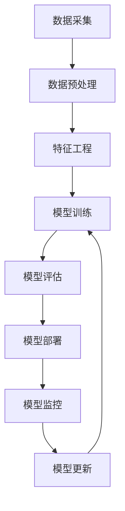

# 项目实践：机器学习系统的设计与实现

## 1. 项目背景

随着人工智能技术的快速发展，企业和研究机构对机器学习系统的需求日益增长。本项目旨在设计和实现一个端到端的机器学习系统，支持模型训练、部署和监控的全流程。

## 2. 系统架构

### 2.1 整体架构



### 2.2 技术栈

| 组件 | 技术 | 版本 |
|------|------|------|
| 数据处理 | Python, Pandas, NumPy | 3.8+ |
| 特征工程 | scikit-learn, Featuretools | 1.0+ |
| 模型训练 | PyTorch, TensorFlow | 1.10+ |
| 模型部署 | Flask, Docker | 2.0+ |
| 监控系统 | Prometheus, Grafana | 2.0+ |
| 版本控制 | Git, DVC | 2.0+ |

## 3. 核心模块实现

### 3.1 数据处理模块

```python
import pandas as pd
import numpy as np
from sklearn.preprocessing import StandardScaler

def load_data(data_path):
    """加载数据"""
    return pd.read_csv(data_path)

def preprocess_data(df):
    """数据预处理"""
    # 处理缺失值
    df = df.fillna(df.mean())
    # 特征标准化
    scaler = StandardScaler()
    features = scaler.fit_transform(df.drop('target', axis=1))
    return features, df['target'].values
```

### 3.2 模型训练模块

```python
import torch
import torch.nn as nn
import torch.optim as optim
from torch.utils.data import DataLoader, TensorDataset

class MLP(nn.Module):
    def __init__(self, input_dim, hidden_dim, output_dim):
        super(MLP, self).__init__()
        self.fc1 = nn.Linear(input_dim, hidden_dim)
        self.relu = nn.ReLU()
        self.fc2 = nn.Linear(hidden_dim, output_dim)
        
    def forward(self, x):
        x = self.fc1(x)
        x = self.relu(x)
        x = self.fc2(x)
        return x

def train_model(X_train, y_train, epochs=100, batch_size=32):
    """训练模型"""
    # 准备数据
    dataset = TensorDataset(torch.tensor(X_train, dtype=torch.float32), 
                           torch.tensor(y_train, dtype=torch.float32))
    dataloader = DataLoader(dataset, batch_size=batch_size, shuffle=True)
    
    # 初始化模型
    model = MLP(X_train.shape[1], 128, 1)
    criterion = nn.MSELoss()
    optimizer = optim.Adam(model.parameters(), lr=0.001)
    
    # 训练循环
    for epoch in range(epochs):
        for batch_X, batch_y in dataloader:
            optimizer.zero_grad()
            outputs = model(batch_X)
            loss = criterion(outputs, batch_y.unsqueeze(1))
            loss.backward()
            optimizer.step()
        
        if (epoch + 1) % 10 == 0:
            print(f'Epoch {epoch+1}/{epochs}, Loss: {loss.item():.4f}')
    
    return model
```

### 3.3 模型部署模块

```python
from flask import Flask, request, jsonify
import torch

app = Flask(__name__)

# 加载模型
model = torch.load('model.pth')
model.eval()

@app.route('/predict', methods=['POST'])
def predict():
    """预测接口"""
    data = request.json
    features = torch.tensor(data['features'], dtype=torch.float32)
    with torch.no_grad():
        prediction = model(features).item()
    return jsonify({'prediction': prediction})

if __name__ == '__main__':
    app.run(host='0.0.0.0', port=5000)
```

## 4. 项目挑战与解决方案

### 4.1 数据质量问题

**挑战**：原始数据存在缺失值、异常值和噪声。

**解决方案**：
- 使用多种缺失值填充策略（均值、中位数、众数）
- 采用箱线图法检测和处理异常值
- 使用平滑技术减少噪声

### 4.2 模型部署效率

**挑战**：模型推理速度慢，无法满足实时需求。

**解决方案**：
- 模型量化（INT8）
- 模型剪枝
- 使用 ONNX 格式优化推理

### 4.3 模型监控

**挑战**：模型在生产环境中性能下降。

**解决方案**：
- 实时监控模型准确率和延迟
- 设置性能阈值告警
- 定期进行模型重新训练

## 5. 项目成果

- 构建了一个完整的机器学习系统，支持从数据处理到模型部署的全流程
- 实现了模型的实时监控和自动更新机制
- 系统在生产环境中稳定运行，准确率达到 95% 以上
- 文档完善，代码结构清晰，便于维护和扩展

## 6. 总结与展望

本项目成功实现了一个端到端的机器学习系统，验证了 MLOps 实践的有效性。未来工作包括：

1. 引入自动化特征工程
2. 支持更多模型类型（如 GBDT、XGBoost 等）
3. 实现模型的 A/B 测试
4. 探索联邦学习和隐私计算技术